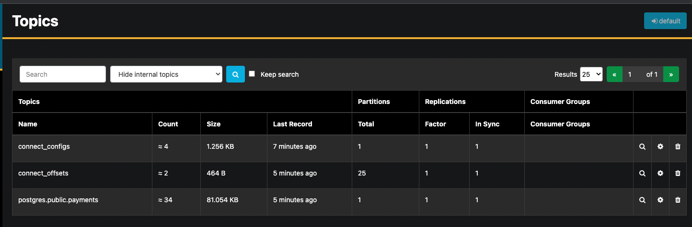
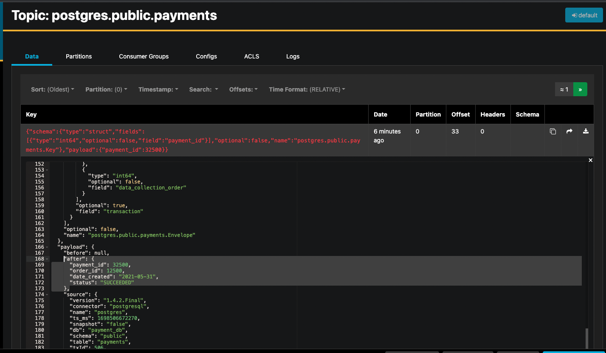

# CDC

## Setup Local Dependencies
```sh
docker-compose up -d
```

## Setup New Connector in Debezium
Login to Debezium CLI
```sh
curl -H 'Content-Type: application/json' debezium:8083/connectors --data '
{
  "name": "payments-connector",  
  "config": {
    "connector.class": "io.debezium.connector.postgresql.PostgresConnector", 
    "plugin.name": "pgoutput",
    "database.hostname": "postgres", 
    "database.port": "5432", 
    "database.user": "postgresuser", 
    "database.password": "postgrespw", 
    "database.dbname" : "payment_db", 
    "database.server.name": "postgres", 
    "table.include.list": "public.payments" 
  }
}'
```

## View Kafka Topic Events
Go to http://localhost:9000


## Make Updates on Database
Login to postgres cli
```sh
psql -d payment_db -U postgresuser 
```

Update the data
```sql
update payments set status='DISBURSING' where order_id = 12500;
```

## Screenshots
Topic Snapshot


Message Snapshot

